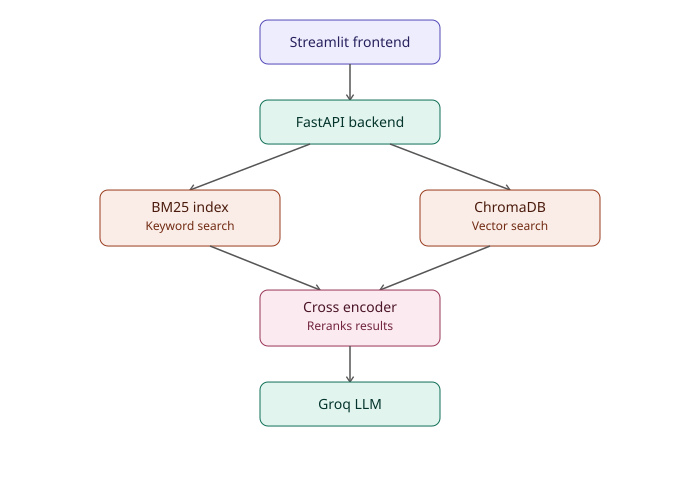

# 📊 Ask My Company Reports

An **agentic RAG system** that answers questions about company financial reports (SEC 10-K filings and similar documents) with grounded, cited answers — built as a placement resume project, with a real evaluation suite, CI pipeline, and Docker deployment.

Built and tested against Tesla's SEC 10-K filing, and extended to support uploading **any** PDF report.

---

## Features

- **Hybrid retrieval** — combines BM25 keyword search with dense vector search (embeddings), so results aren't dependent on exact wording alone
- **Cross-encoder reranking** — a second, more accurate pass re-scores the combined candidates before picking the final context (verified: moved the correct answer chunk from rank 9 → rank 1–2 in testing)
- **Enforced citations** — every factual claim in an answer must cite its source chunk; the model is instructed to say "I cannot find this information" rather than guess
- **Agentic decision loop** — after retrieval, the system judges the result as:
  - `SUFFICIENT` → answers directly
  - `INSUFFICIENT` → rewrites the query and retries retrieval once
  - `AMBIGUOUS` → asks the user a clarifying question instead of guessing (e.g., correctly detected that Tesla's 10-K has three different "automotive revenue" figures for 2023 and asked which one was meant)
- **Evaluation suite** — an 8-question test set with tolerance-based numeric matching (handles unit differences like "$87.6 billion" vs "87,604 million"); currently at **100% accuracy**
- **CI pipeline** — GitHub Actions automatically rebuilds the vector index and reruns the evaluation suite on every push
- **FastAPI backend + Streamlit frontend** — a real two-part architecture; the frontend talks to the backend over HTTP, not via direct function imports
- **Dockerized** — both backend and frontend run as separate containers via Docker Compose, so the whole system runs identically on any machine
- **Upload any PDF** — not limited to Tesla; any uploaded report gets its own fresh chunk index, BM25 index, and vector collection
- **Session persistence** — uploaded PDFs are saved to disk, so sessions survive a backend restart
- **Input validation & error handling** — clear error messages for empty/corrupted PDFs, oversized files, missing API keys, and invalid questions, instead of raw crashes

---

## Architecture



**Flow:** Streamlit frontend → FastAPI backend → BM25 + ChromaDB (parallel hybrid search) → Cross-encoder reranker → Groq LLM → answer returned to frontend

---

## Tech Stack

| Component | Technology |
|---|---|
| LLM | Groq (`openai/gpt-oss-120b`) |
| Embeddings | `sentence-transformers` (`all-MiniLM-L6-v2`) |
| Vector store | ChromaDB |
| Keyword search | `rank_bm25` (BM25Okapi) |
| Reranker | `cross-encoder/ms-marco-MiniLM-L-6-v2` |
| PDF parsing | `pypdf` |
| Backend | FastAPI + Uvicorn |
| Frontend | Streamlit |
| Deployment | Docker + Docker Compose |
| CI | GitHub Actions |

---

## Design Decisions

| Decision | Why |
|---|---|
| Groq (not OpenAI) | Free tier, fast inference speed, good enough accuracy for this use case |
| Hybrid search (BM25 + vectors), not vectors alone | Vector search alone misses exact terms (names, dollar figures); BM25 alone misses paraphrased questions |
| Cross-encoder reranking | Hybrid search's raw ranking isn't always accurate — reranking measurably improved it (a correct chunk moved from rank 9 to rank 1-2 in testing) |
| Tolerance-based numeric matching in eval | LLMs format numbers inconsistently ("$87.6 billion" vs "87,604 million") — exact string matching produced false failures on correct answers |
| FastAPI + Streamlit (separate services) | Mirrors a real frontend/backend split, rather than one script mixing UI and logic |
| Session files on disk (not Redis/a database) | Simple, sufficient for a single-user demo; a real multi-user deployment would need a proper database instead |

---

## Project Structure

├── data/
│ └── tesla.pdf # Tesla's SEC 10-K filing (fixed dataset)
├── chroma_db/ # Persistent vector store (generated, gitignored)
├── sessions/ # Saved uploaded PDFs, for session persistence (gitignored)
├── rag_pipeline.py # Core RAG logic: retrieval, reranking, answering, agentic loop
├── api.py # FastAPI backend (endpoints: /ask, /upload, /ask-pdf)
├── app.py # Streamlit frontend
├── main.py # Builds the Tesla vector index
├── eval_questions.py # Evaluation question set
├── run_eval.py # Runs the evaluation suite, reports accuracy
├── test_agentic.py # Manual test script for the agentic decision loop
├── architecture.svg # Architecture diagram
├── Dockerfile.backend
├── Dockerfile.frontend
├── docker-compose.yml
├── requirements.txt
├── requirements-frontend.txt # Lighter dependency set for the frontend container
└── .github/workflows/eval.yml # CI: rebuilds index + runs eval on every push


---

## Setup

### 1. Clone and install dependencies

```powershell
git clone <your-repo-url>
cd "RAG AI AGENT"
python -m venv venv
.\venv\Scripts\activate
pip install -r requirements.txt
```

### 2. Add your Groq API key

Create a `.env` file in the project root:

GROQ_API_KEY=your_key_here


The app will fail immediately with a clear message on startup if this is missing.

### 3. Build the Tesla vector index

```powershell
python main.py
```

### 4. Run the app (locally, without Docker)

In one terminal:
```powershell
uvicorn api:app --host 127.0.0.1 --port 8000
```

In a second terminal:
```powershell
streamlit run app.py
```

Open `http://localhost:8501` in your browser.

### 5. Or run everything with Docker

Requires Docker Desktop running.

```powershell
docker compose up --build
```

Open `http://localhost:8501`.

---

## Running the Evaluation Suite

```powershell
python run_eval.py
```

Runs 8 test questions against the Tesla dataset and reports pass/fail with an overall accuracy percentage. This same suite runs automatically in CI on every push (see `.github/workflows/eval.yml`).

---

## Testing the Agentic Decision Loop

```powershell
python test_agentic.py
```

Ask it a question and it will show the decision trail — whether it answered directly, retried with a rewritten query, or asked for clarification.

---

## Known Limitations

- Session persistence uses simple file storage, not a database — fine for a single-user demo, but wouldn't scale to concurrent multi-user production traffic
- The agentic decision loop is scoped specifically to retrieval decisions (search again / ask for clarification), not general multi-tool actions
- No support for extracting or interpreting embedded images/charts within uploaded PDFs (attempted, rolled back due to reliability issues with vision-model rate limits)
- No monitoring/metrics or structured logging — reasonable for a demo project, would be a real gap in an actual production deployment

---

## Development Journey (for context)

This project went through several real debugging cycles worth noting:
- Eval accuracy: 60% → 75% → 100%, via fixing a Unicode-spacing scoring bug and switching to tolerance-based numeric matching instead of exact substring matching
- Discovered and fixed recurring ChromaDB collection-name mismatches across scripts
- Resolved a Docker build issue where `torch` pulled in unnecessary multi-hundred-MB NVIDIA CUDA packages (fixed by installing a CPU-only build explicitly)